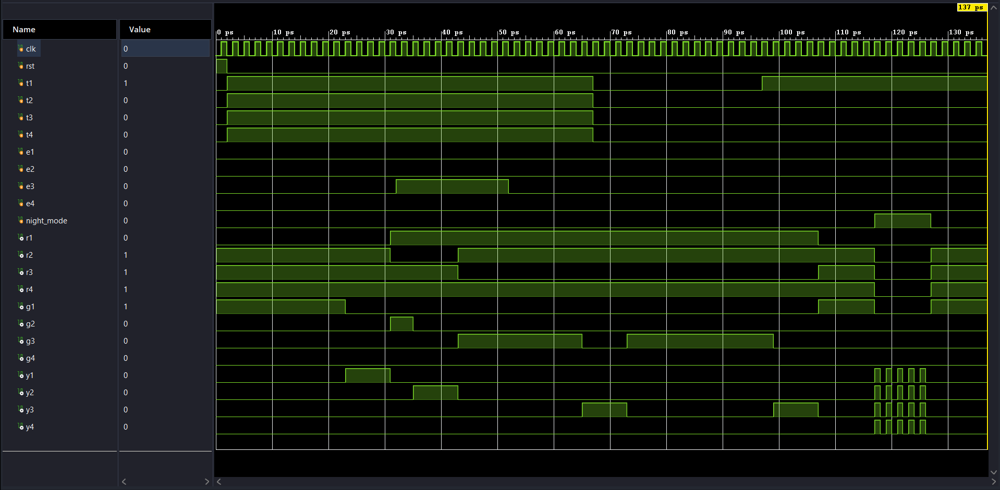

# 🚦 Intelligent Four-Way Traffic Light Controller (Verilog HDL)

A **Finite State Machine (FSM)** based intelligent four-way traffic light controller implemented in **Verilog HDL**. Unlike a conventional traffic signal, this controller dynamically manages traffic using **vehicle detection sensors**, supports **Night Mode** with blinking yellow signals, and provides **Emergency Vehicle Priority** for faster and safer traffic management.

The design is fully synthesizable, functionally verified using a Verilog testbench, and simulated in **Xilinx Vivado**.

---

# 📌 Features

✅ Four-way traffic intersection

✅ Finite State Machine (FSM) architecture

✅ Vehicle detection sensors for adaptive traffic control

✅ Emergency vehicle detection with automatic priority

✅ Night mode with blinking yellow signal

✅ Clock-driven state transitions

✅ Synthesizable RTL design

✅ Functional verification using testbench

---

# 📂 Project Structure

```
Traffic_Light/
│
├── traffic_light.v
├── traffic_light_tb.v
├── ckt_diagram.pdf
├── synthesized_diagram.pdf
├── waveform.png
├── result.txt
└── README.md
```

---

# ⚙️ System Overview

The controller manages traffic at a four-way intersection.

### Normal Mode

- Only one direction receives Green at a time.
- Other directions remain Red.
- Yellow is used during state transitions.
- The sequence repeats continuously.

---

### Vehicle Detection

Each road is equipped with a traffic sensor.

If a vehicle is detected on a road waiting for service, the controller schedules that direction for the next Green phase instead of wasting time on an empty road, improving traffic flow and reducing unnecessary waiting.

---

### Emergency Vehicle Priority

Each road includes an emergency sensor.

When an emergency vehicle (ambulance, fire truck, police vehicle, etc.) is detected:

- Current traffic cycle is interrupted safely.
- The corresponding road immediately receives a Green signal.
- All other roads remain Red.
- After the emergency vehicle passes, the controller resumes normal operation.

---

### Night Mode

During low-traffic hours, the controller enters **Night Mode**.

Instead of the normal traffic sequence:

- Yellow signal blinks continuously.
- Red and Green signals remain OFF.
- Power consumption is reduced.
- Drivers are alerted to proceed cautiously.

---

# 🛠 Tools Used

- Verilog HDL
- Xilinx Vivado

---

# 📚 Digital Design Concepts

- Finite State Machines (FSM)
- Sequential Logic
- Combinational Logic
- State Encoding
- Traffic Control Systems
- Priority Scheduling
- Sensor-Based Decision Making
- RTL Design
- Testbench Development

---

# 📁 Files

| File | Description |
|------|-------------|
| traffic_light.v | Verilog RTL implementation |
| traffic_light_tb.v | Testbench |
| ckt_diagram.pdf | RTL circuit diagram |
| synthesized_diagram.pdf | Synthesized hardware schematic |
| waveform.png | Simulation waveform |
| result.txt | Simulation output |

---

# ▶️ Simulation

Run the following files in Xilinx Vivado:

- traffic_light.v
- traffic_light_tb.v

The testbench verifies:

- Normal traffic sequence
- Vehicle detection logic
- Emergency priority operation
- Night mode functionality
- Correct state transitions

---

# 📸 Simulation Waveform

```markdown

```

---

# 📈 RTL Circuit Diagram

See:

- **ckt_diagram.pdf**

---

# 🔧 Synthesized RTL Diagram

See:

- **synthesized_diagram.pdf**

---

# ✅ Results

The controller was successfully:

- Simulated in Xilinx Vivado
- Functionally verified using a custom Verilog testbench
- Synthesized successfully
- Validated for normal operation, adaptive traffic control, emergency priority, and night mode

---

# 👨‍💻 Author

**Ritesh Kumar**

Electrical Engineering Undergraduate  
**Indian Institute of Technology (IIT) Ropar**

**Interests:** RTL Design • Digital Design • Computer Architecture • VLSI

GitHub: https://github.com/Ritesh2006VLSI
